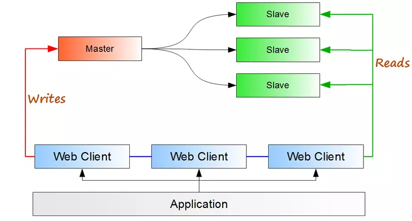

# Mysql Configuration: Master - Slave

!

### references:
- https://phoenixnap.com/kb/mysql-master-slave-replication

- https://www.digitalocean.com/community/tutorials/how-to-set-up-mysql-master-master-replication

## 1. MASTER

#### 1.0 install mysql:

```
sudo apt-get update

sudo apt-get install mysql-server mysql-client


sudo mysql_secure_installation
```

#### 1.1 check and edit configuration file:

```
- files/master-mysql.cnf
- files/slave01-mysql.cnf
```

#### 1.2 create user replicator user:

```
# create replicator user:
create user 'replicator'@'%' identified by '123456';

# grant permissions to replicator:
grant replication slave on *.* to 'replicator'@'%';

flush privileges;
```
#### 1.3 check status:

```
show master status;
```

## 2. SLAVE

#### 2.0 install mysql:

```
sudo apt-get update

sudo apt-get install mysql-server mysql-client

sudo mysql_secure_installation
```

#### 2.1 check and edit configuration file:

```
- files/slave01-mysql.cnf
```

[alt text](images/master-master.png)